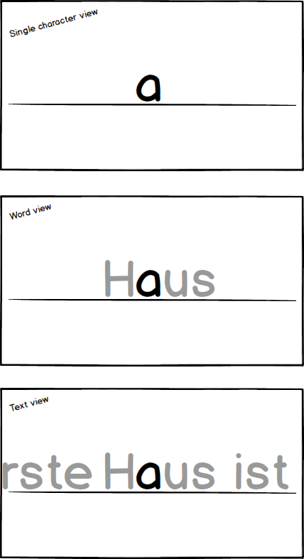
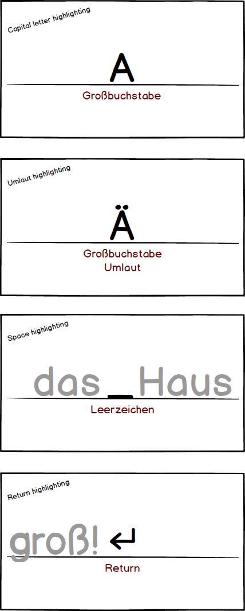
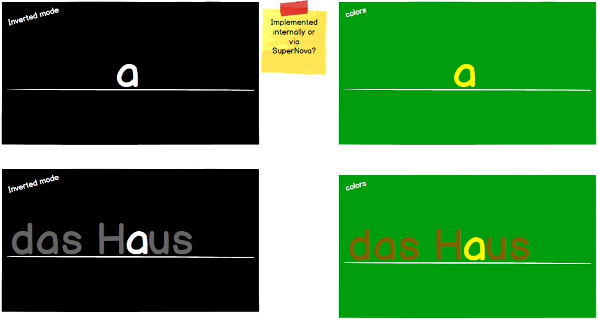

# FireFinger

**wip** this needs a big update...

## Instructions
(TODO)

Custom dictations can be put into **%appdata%/FireFinger/docs** */subfolder/example.txt*  

## Changelog
All notable changes to this project will be documented in this file.

### [0.8.0] Second alpha release
- Features:
    - Added Ctrl+Up/Down for zooming
    - Added reload chapters button to the chapter selection screen
    - The username will now be displayed on the login button, if someone is logged in
- Fixes:
    - Increased upper and lower zoom bounds
    - Fixed issue where footer and header would get distorted at very high/low zooms
    - Fixed certain special characters not being recognized
    - Fixed issues that occured with lower resolution screens (e.g. laptops)
    - Fixed settings screen text and buttons (also removed sliders)
    - Many more minor improvements and fixes...

### [0.7.0] First alpha release
- Most vital features are present in this release
-  Fixes:
    - Improved accuracy of stats calculation
    - Slightly improved end of level screen - still needs some work
    - Fixed first letter of setence and words dissappearing from prev section

 ### [<0.7.0] Testing

## Technical
Uses node.js 10.3.0 and npm 6.xxx

## Introduction

## Mockups

## Architecture

## Usage

## Legal disclaimer
